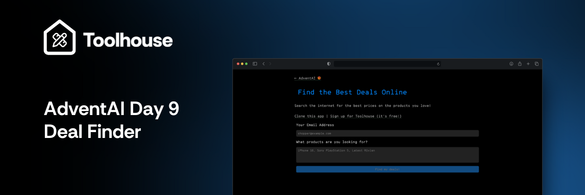

# Hello AdventAI - Day 9️⃣



[](https://github.com/new?template_owner=toolhouse-community&template_name=adventai-d9&owner=%40me&name=th-adventai-d9&description=AdventAI+Day+9+Fork&visibility=public)

## Table of Contents

- [Hello AdventAI - Day 9️⃣](#hello-adventai---day-9️⃣)
  - [Table of Contents](#table-of-contents)
  - [Introduction to AdventAI](#introduction-to-adventai)
    - [Registration](#registration)
  - [Introduction to Toolhouse](#introduction-to-toolhouse)
    - [Key Features](#key-features)
  - [About the App](#about-the-app)
    - [How to Deploy](#how-to-deploy)
  - [Getting Started](#getting-started)
    - [Fork and Clone the App](#fork-and-clone-the-app)
    - [Pre-requisites](#pre-requisites)
    - [Requirements](#requirements)
    - [Setup Toolhouse](#setup-toolhouse)
    - [Installation](#installation)
    - [Development](#development)
    - [Build a New Use Case](#build-a-new-use-case)
  - [Get Help](#get-help)
  - [License](#license)
  - [Code of Conduct](#code-of-conduct)

## Introduction to AdventAI

AdventAI is an initiative from Toolhouse that blends the festive spirit of Christmas through December with daily challenges designed for AI enthusiasts.

Participants unlock a new app daily that they can use, configure, and distribute or even monetize. Each app bridges the gap between AI and real-time functions with the use of Tools.

> [!NOTE]
> Tools are serverless functions that run on the Toolhouse infrastructure, and empower LLMs with new functionalities like scraping the internet, a particular website, or sending emails.

### Registration

To sign up and receive notifications and guides about upcoming apps throughout the initiative, register on [adventai.dev](https://adventai.dev/).

## Introduction to Toolhouse

Toolhouse is the first cloud platform that allows developers to quickly build, manage, and run AI function calling. We take care of every aspect of connecting AI to the real world, from performance optimization to prompting to integrations with all foundational models, in just three lines of code.

[](https://docs.toolhouse.ai/)

### Key Features

✅ Easy Implementation

✅ Universal SDK

✅ Fast and Secure

✅ Built for Privacy

✅ Fantastic Developer Experience

## About the App


On Day ️9️⃣, we are unwrapping a Deal Finder app that based on your preferences and recommendations, looks for trending deals and sends you notifications based on the findings, daily.

What the app does:

- **Trending Deals Search**: Using the `web_search` tool, hunts for the best, trending deals of your liked products or topics.
- **Daily Email Notifications**: Delivers new deals daily based on your preferences right in your inbox.

> [!NOTE]
> This app requires the `send_email`, `memory_fetch`, `memory_store`, `memory_delete` and `web_search` tools.

### How to Deploy

The app can deploy on any service that can host Python 3.12. For convenience, we made it easy to deploy on Heroku and Render.

[](https://www.heroku.com/deploy)
[](https://render.com/deploy)

## Getting Started

### Fork and Clone the App

- [](https://github.com/new?template_owner=toolhouse-community&template_name=adventai-d9&owner=%40me&name=th-adventai-d9&description=AdventAI+Day+9+Fork&visibility=public)
  
  Or Create a [Fork](https://github.com/new?template_owner=toolhouse-community&template_name=adventai-d9owner=%40me&name=th-project&description=AdventAI+Day+9+Fork&visibility=public)

> [!WARNING]
> We recommend forking the app first instead of directly cloning so you can add your own changes on your copy as you go. This also allows you to open a PR easily and showcase your app to other participants!

- Execute the following in your terminal, replacing your username below:

```bash
git clone https://github.com/{USERNAME}/adventai-d9/
cd adventai-d9
```

### Pre-requisites

- Python 3.12.7
- Poetry

### Requirements

- A [Toolhouse](https://toolhouse.ai) account. If you don't have one already, follow this [link](https://join.toolhouse.ai).
- Any LLM of your liking. All our apps and Toolhouse are universally compatible with LLMs.

### Setup Toolhouse

- Login to your [Toolhouse Account](https://app.toolhouse.ai/) and grab your API Key. We'll be using it in the next steps.

> [!NOTE]
> The tools we'll be using in this project are pre-installed in a Bundle that's already linked to your account and the app.

### Installation

1. **Install Poetry**

   ```bash
   poetry install
   ```

2. **Configure Environment Variables**

   Copy the provided .env.example file to a new .env file:

   ```bash
   cp .env.example .env
   ```

   Fill in the required values in the .env file. Ensure you update all placeholders with the correct values.

3. **Run the Development Server**

   To run on <http://0.0.0.0:8000>:

   ```bash
   hypercorn main:app --bind 0.0.0.0:8000
   ```

   You can use `watchexec` to monitor changes and reload changes automatically.

   ```bash
     watchexec -r -e py "hypercorn main:app --bind 0.0.0.0:8000" 
    ```

   To reload changes you made to the frontend, simply refresh your browser.

### Development

Because your function calling infrastructure and code are hosted on Toolhouse, all apps from AdventAI are actually just a collection of prompts and some business logic.

Each app has this:

- **`main.py`** is the main entry point. It sets up the API routes and serves static content.
- **`api`** contains the backend endpoints:
  - **`api/chat`** streams responses to the LLM you choose
  - **`api/cron`** contains the logic to perform actions every day
  - **`api/config`** will read the configuration for the app you want and serve it back to the frontend
- **`static`** contains the frontend
- **`prompts`** contains the prompts needed by each use case, as well as the UI configuration

Here is how an app gets loaded:

- Each AdventAI app will be served at `/app/<your_app_name>`, where `<your_app_name>` must match one of the filenames in the `prompts` folder (for example `/app/random-pet-fact`).
- The frontend will call `/app/config`. The backend will look at the referer header to infer the app name. It will then send the appropriate configuration. For example, if you're calling `/app/random-pet-fact`, `/app/config` will open `prompts/random-pet-fact.toml`, covert it to JSON, and serve it to the frontend.
- The frontend will read the configuration and set itself up.

### Build a New Use Case

Most of the work is already done for you! Simply copy `prompts/_template.toml` and fill in the blanks. You can follow one of the other pre-configured configurations for inspiration.

## Get Help

We have a thriving community of developers building with Toolhouse. Join us on Discord and share your questions, concerns and feedback!

[](https://discord.gg/jWDzFNXWS4)

## License

All the apps under AdventAI are available under the MIT license. See the [LICENSE](LICENSE) file for more information.

## Code of Conduct

AdventAI follows the Contributor Covenant [Code of Conduct](https://www.contributor-covenant.org/version/2/1/code_of_conduct/code_of_conduct.md) for all incoming contributions.

[Back to Top ⬆️](#hello-adventai---day-9️⃣)
